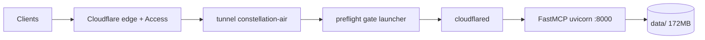

# Constellation — Disaster Recovery & iMac Retirement Record

**Document version:** 1.0
**Date:** 2026-07-06 (America/Los_Angeles) / 2026-07-07Z
**Authored:** Mike (aarzamen) with Claude, compiled from live interrogation of the production system — not from memory.
**Repo state at writing:** `23edf91` ("docs: SWEEP v2 report", 2026-07-04), working tree clean on production host.
**Audience:** A future LLM session with terminal access, tasked with rebuilding or repairing this system after loss of the production host. Explicit paths, explicit HUMAN WALL markers, verification gates after every phase. Verify `hostname` before every destructive command — wrong-machine incidents are a documented failure mode of this project.

---

## 0. What this system is

Constellation is Mike's personal AI-conversation memory layer: exported conversations from eight providers, embedded and indexed locally, served as an MCP server over streamable HTTP, fronted publicly by a Cloudflare named tunnel with Cloudflare Access in front and fail-closed JWT re-verification at the origin.

**Canonical host:** `clyde-air` — MacBook Air M1, 8GB, macOS, 24/7 duty (sleep disabled).

**Corpus snapshot at writing:** 3,665 conversations · 55,831 messages · 2023-12-13 → 2026-07-04 · providers: claude 1293, chatgpt 1150, abacus 512, gemini 276, grok 201, aistudio 171, claude-code 51, notebooklm 11.

## 1. As-built inventory (clyde-air)

| Component | Value |
|---|---|
| Repo | `~/dev/constellation-v3` (clone of github.com/aarzamen/constellation-v3) |
| Python | `.venv` in repo root, Python 3.12.13 |
| Data | `~/dev/constellation-v3/data/` — 172 MB (inventory below) |
| MCP server | LaunchDaemon `/Library/LaunchDaemons/com.constellation.mcp.plist` → `.venv/bin/python server/mcp_server.py --transport streamable-http --host 127.0.0.1 --port 8000` |
| Tunnel daemon | `/Library/LaunchDaemons/com.constellation.tunnel.plist` → `/usr/local/bin/constellation-tunnel-launch` (preflight gate, root-owned) |
| Live tunnel config | `~/.cloudflared/config.yml` (ama, 600) — OUTSIDE the repo, by design |
| Nightly ingest | user LaunchAgent `~/Library/LaunchAgents/com.constellation.nightly.plist`, fires 03:30 |
| Logs | `~/Library/Logs/constellation/` (daemon out/err + preflight) — OUTSIDE the repo |
| Metrics | cloudflared on `127.0.0.1:20241` (`/ready`, `/metrics`) |
| Tunnel | `constellation-air`, UUID `f7c26e8f-7199-495b-921a-d417b0a4980e`, ingress `mcp.constellation-memory.com → http://127.0.0.1:8000` |
| DNS | single record: CNAME `mcp.constellation-memory.com → f7c26e8f-....cfargotunnel.com`, proxied |
| Access | Cloudflare Access app on that hostname, team `arzamendi`, AUD `8e03d9bab8732d3a85702f68e15abad31d4ad80021aac4e1d27605d7521c5878` |
| Service token | `openai-clients` (client_id `1d73e47f1cb5ce715e79ad11eaa64ed7.access`, expires 2027-07-07); secret at MBP `~/.config/constellation/openai-clients.env`, chmod 600 — NEVER echo values |

**data/ inventory (2026-07-07Z):** `conversations.json` 129.2 MB · `chunk_embeddings.npy` 39.6 MB · `embeddings.npy` 5.6 MB · `graph_data.json` 4.7 MB · `chunk_to_conv.json` 147 KB · `notes.json` 45 KB · `clusters.json` 2 KB · `nightly_manifest.json` 12 KB · `logs/`

**Point-in-time integrity references** (these files mutate — nightly for the corpus, on every note write for notes):
```
sha256(conversations.json) = 1533161eabdb299af0a0b3b1ba1239660d1d6624d665d0a2b73c2053f87a22cc
sha256(notes.json)         = c8703b4ddc0319d064e9a76caa41f482f95cd06c69bac9170f7c15441ac9e71f
```



## 2. Invariants — violate these and you recreate our outages

1. The live cloudflared config NEVER lives in a git working tree. Live: `~/.cloudflared/config.yml`. The repo's `deploy/cloudflared-config.yml` is a TEMPLATE ONLY and is never read by any daemon.
2. The placeholder trigger tokens (the exact strings are the grep pattern inside `deploy/hardening/constellation-tunnel-launch` — read it) never appear in the live config file, comments included. The gate scans the whole file. This document deliberately does not spell them.
3. The launcher lives root-owned in `/usr/local/bin`. On clean Apple Silicon macOS that directory DOES NOT EXIST — create it first (`install -d -o root -g wheel -m 755 /usr/local/bin`), or BSD `install` fails with a cryptic `INS@tmpfile: No such file or directory`.
4. clyde-air never sleeps: `pmset -c sleep 0` + `pmset -a disablesleep 1` (applied 2026-07-07). Amphetamine runs as the visible menu-bar layer.
5. Daemon logs live in `~/Library/Logs/constellation/`, never inside the repo.
6. The charger must out-supply 24/7 load draw. See incident 2.

## 3. Failure history (why the invariants exist)

- **2026-07-04 → 07-06, config crash loop.** A git operation on 07-04 01:22 silently restored the template (with placeholder tokens) over the live config while cloudflared ran on in-memory state. The 07-05 reboot forced a re-read → crash loop at launchd's throttle interval, ~4,400 attempts over 9 hours, silent to the outside. Fixed via SSH rescue + config repair. Produced invariants 1–2 and the preflight gate.
- **2026-07-06, power death + sleep relapse.** Undersized charger lost the race against battery drain under 24/7 load; machine died. After repower, it idle-slept again minutes later, mid-write of a Constellation note. Produced invariants 4/6; low-battery alerting remains an open TODO.
- **2026-07-07, hardening deployed.** Gate + config relocation installed (this document's occasion). The gate's first live firing caught its own config header comment naming a trigger token — extending invariant 2 to comments. Working exactly as designed, twice before breakfast.

## 4. Rebuild runbook — fresh Mac to full service

Rules for the executing LLM: Mike types all secrets and sudo credentials himself; you never see values. Stop at every HUMAN WALL. Verify each phase's gate before the next.

**Phase 0 — prerequisites.** macOS user `ama`. Xcode CLT. Homebrew. `brew install cloudflared`. Python 3.12+.
**Phase 1 — code.** `git clone https://github.com/aarzamen/constellation-v3.git ~/dev/constellation-v3 && cd ~/dev/constellation-v3 && python3 -m venv .venv && .venv/bin/pip install -r requirements.txt`
**Phase 2 — data.** Restore `data/` from the newest source, in priority order: (a) latest clyde-air backup/archive, (b) the iMac frozen archive (pre-2026-07-02 state, ~2,0xx conversations — expect a gap, re-ingest after), (c) full re-ingest from raw provider exports. Gate: a stats call returns plausible conversation counts.
**Phase 3 — local MCP service.** Adapt `deploy/com.constellation.mcp.plist` paths if needed; install to `/Library/LaunchDaemons` + `launchctl bootstrap system ...` (HUMAN WALL: sudo). Gate: `127.0.0.1:8000/mcp` answers (an MCP handshake error is fine; connection-refused is not).
**Phase 4 — tunnel.** HUMAN WALL: `cloudflared tunnel login` (browser OAuth is Mike's). `cloudflared tunnel create constellation-air2` (or reuse the name if the old tunnel is deleted). Write `~/.cloudflared/config.yml` FROM the repo template, substituting the printed UUID and creds path. Keep metrics `127.0.0.1:20241`. Never commit the live file back.
**Phase 5 — hardening.** `mkdir ~/tunnel-hardening`, copy the three files from `deploy/hardening/` plus your new live config into it, read `install.sh` first (it is rollback-capable and expects `$STAGE=/Users/ama/tunnel-hardening`), then HUMAN WALL: `sudo bash ~/tunnel-hardening/install.sh`. Gate: `curl 127.0.0.1:20241/ready` shows readyConnections ≥ 1 and the preflight log ends in an OK line.
**Phase 6 — DNS + Access.** Point the CNAME `mcp.constellation-memory.com → <NEW-UUID>.cfargotunnel.com` (proxied). The Access app survives host loss (it lives in Cloudflare); if it must be recreated, ALL connector OAuth tokens invalidate — reconnect the claude.ai connector via web settings (Desktop's OAuth flow is known-flaky; use web), and re-mint service tokens (secrets are shown once at creation, only).
**Phase 7 — nightly.** Install `deploy/com.constellation.nightly.plist` as a user LaunchAgent (03:30). Gate: next-day `nightly_manifest.json` updates.
**Phase 8 — full verification.** All must pass: local `/ready`; Cloudflare tunnel API shows healthy connections; end-to-end MCP `get_stats` through the public hostname; claude.ai connector round-trip.

## 5. Canonical health checks

- **Local:** `curl -s http://127.0.0.1:20241/ready` → `{"status":200,"readyConnections":N,...}`
- **Edge:** Cloudflare API `GET /accounts/{account}/cfd_tunnel?is_deleted=false` — connection list with colos/timestamps. NOTE: a 401 from the public hostname proves only that Access is up, NOT that the origin is alive; the tunnel API sees origin liveness.
- **End-to-end:** MCP initialize + `get_stats` against `https://mcp.constellation-memory.com/mcp` with `CF-Access-Client-Id/Secret` headers (secret path in §1). This is the definitive "is Constellation actually up" probe.

## 6. Data copies map & archive procedure

| Copy | Where | State | Role |
|---|---|---|---|
| Canonical | clyde-air `data/` | mutates nightly | production |
| Frozen snapshot | iMac (original host) | pre-migration, ≈2026-07-01 | safety net until archived + verified |
| Code only | GitHub `aarzamen/constellation-v3` | no corpus data | rebuild source |
| Code clone | MBP `/Users/ama/constellation-v3` | tracks GitHub | dev + secrets holder |
| **MISSING** | offsite/external scheduled archive | — | **open TODO** |

Archive procedure (any host): `cd ~/dev/constellation-v3 && tar -czf ~/constellation-data-$(date +%Y%m%d).tar.gz data/ && shasum -a 256 ~/constellation-data-*.tar.gz > ~/constellation-data-manifest.sha256` — keep two copies, at least one offline, verify checksums on receipt.

## 7. iMac retirement record + at-the-machine runbook

**Status at writing (2026-07-07Z):**
- Legacy tunnel `constellation` (created 2026-03-12, id `dca64438-2081-4be5-8372-7bc51506446b`, ingress `mcp.constellation-memory.com → localhost:8421`) — **deleted from Cloudflare 2026-07-07T04:31:32Z (cascade).** DNS had pointed away since the 2026-07-02T14:24:10Z cutover; verified zero routable traffic since. The iMac's cloudflared is now an orphan retrying a tunnel that no longer exists (harmless auth failures).
- No SSH key path from MBP → iMac (verified 2026-07-07). Everything below requires console access.

**At the iMac (~15 minutes):**
1. Kill the orphan: `launchctl list | grep -iE "cloudflared|constellation|tunnel"` → `launchctl bootout` the matching item(s); `pkill -f cloudflared`; delete the corresponding plist(s) from `~/Library/LaunchAgents` / `/Library/LaunchDaemons`.
2. Archive the frozen corpus: locate the original constellation install (its origin served `:8421`); run the §6 archive procedure; copy the tarball to clyde-air (`~/archives/`) AND an external drive; verify checksums on both.
3. Credential hygiene: `rm -P ~/.cloudflared/*.json ~/.cloudflared/cert.pem` (the tunnel they belonged to is deleted; they authenticate nothing).
4. Optional but recommended: `ssh-copy-id` the MBP's key so future sessions can drive this machine remotely.
5. Dormancy: power down until **2026-08-01** (30-day window from migration). After both archive copies verify: wipe/repurpose at will.

**Related Group-4 leftovers (not iMac-local):** MBP zombie launchd bootout · remove `constellation-local` connector in claude.ai settings · Cloudflare registrant address 29 Palms → Ventura · Tailscale key expiry disabled on all nodes.

## 8. Known open items (as of 1.0)

- Low-battery / power-loss alerting on clyde-air (fail loud) — open since GRAVITY note `b47d4711`.
- Scheduled monitoring on `127.0.0.1:20241` + a cron'd outside-in health check (§5).
- Nightly anomaly: 2026-07-06 03:30 lock file touched but data files unchanged since 07-05 03:35 — inspect `data/logs/`.
- Offsite scheduled archive of `data/` (§6 MISSING row).
- ChatGPT connector OAuth (Path 2) — untested; watch for missing WWW-Authenticate on 401.

## 9. Changelog

- **1.0 · 2026-07-07Z** — Initial. Written immediately after tunnel hardening deployment; legacy `constellation` tunnel deleted; iMac runbook + disposition plan established. Session provenance: Constellation notes `b47d4711`, `7afdd658` on conversation `69ec3f7e-ddd4-83ea-a269-6890d9288107` ("Setting Up Constellation MCP").
